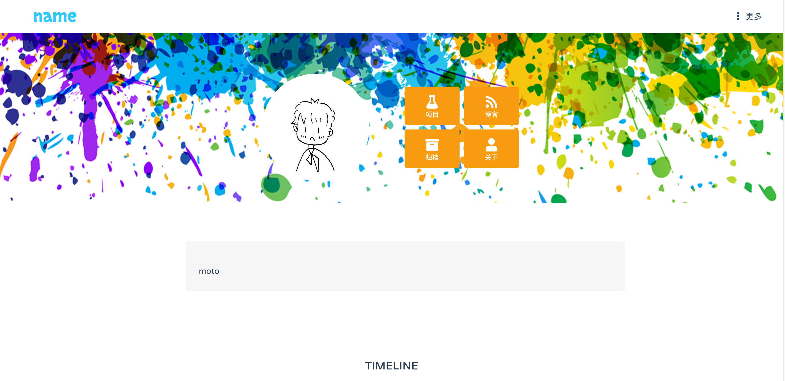
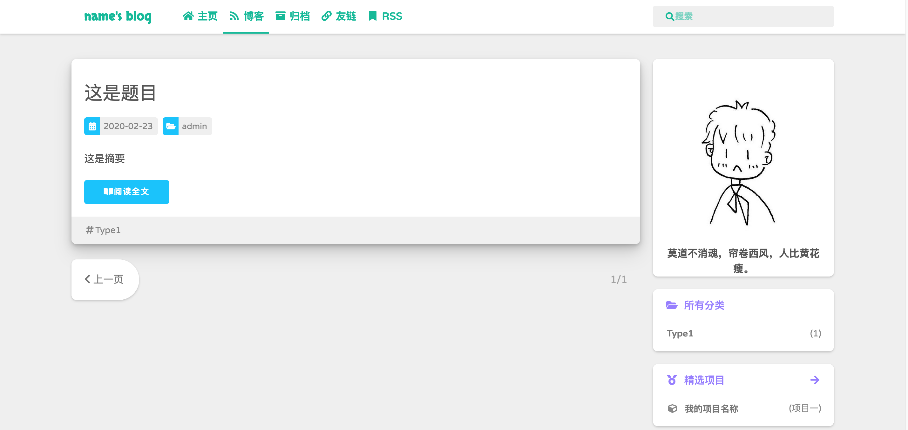
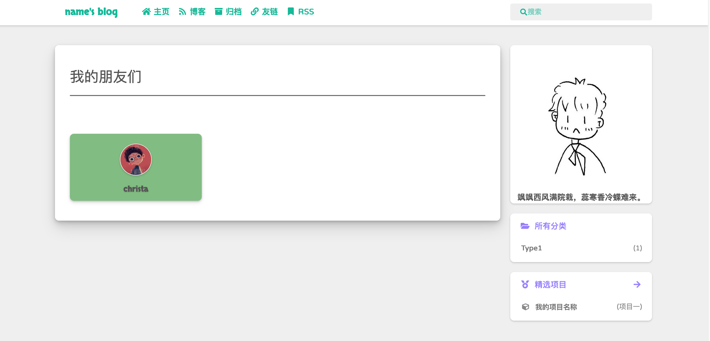

# C1blog v1.0.1


[](https://github.com/christasa/c1blog)

###### 增加Kubernetes服务配置
###### 引入docker

```
example:https://christa.top
```
使用了Material X作为本博客的主题
## Install

Set up account

Change your own information in `cores/views.py`
```python
auth={}
auth['username'] = 'name'
auth['userimgpath'] = '/static/img/user.jpg'
auth['motto'] = 'moto'
auth['github'] = '# '
```
Next, custom admin account in Dockerfile and docker-compose.yml
```dockerfile
ENV SECRET_KEY=SECRET_KEYS USERNAME=postgres PASSWORD=postgres
ENV SUPUSER=admin EMAIL="admin@admin.com" SUPPASSWD=admin
```

```dockerfile
environment:
     POSTGRES_DB: postgres
     POSTGRES_USER: postgres
     POSTGRES_PASSWORD: postgres
```

Finally, run command 
```shell script
docker-compose up -d
```


## 图片预览


  
  





